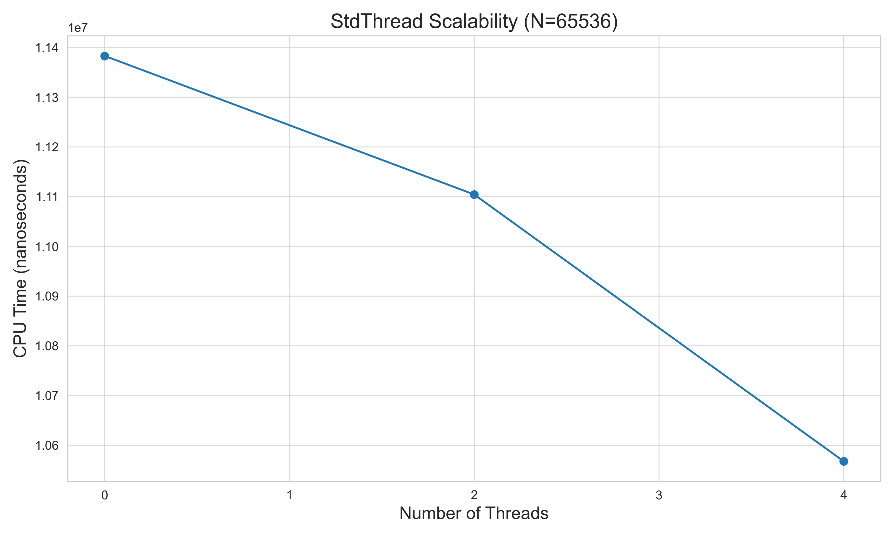

# 研究报告：双调排序算法的实现与性能分析

## 摘要

本报告详细介绍了使用现代C++开发和性能评估多种双调排序（Bitonic Sort）算法实现的过程。项目重点是创建一个普通的顺序版本，以及使用`std::thread`、OpenMP和SIMD（x86 SSE4.1 intrinsics）的并行化版本。这些实现使用CMake构建，并通过vcpkg以清单模式进行管理。通过Google Test的全面单元测试确保了正确性，并使用Google Benchmark系统地测量了性能。基准测试结果导出为CSV格式，并使用Python（Matplotlib/Seaborn）进行可视化，比较了这些不同方法在各种输入大小下的效率。研究结果表明，SIMD和多线程实现在处理较大数据集时性能显著提升，并对`std::thread`版本的可伸缩性提供了见解。

## 1. 引言

### 1.1. 问题陈述
高效排序是计算机科学中的一个基本问题，应用广泛。虽然许多通用排序算法（如快速排序或归并排序）已经高度优化，但像双调排序这样的专用并行排序算法在并行硬件架构上具有优势，并且因其数据无关的比较模式而著称，使其适合硬件实现。

### 1.2. 双调排序算法
双调排序是一种基于比较的并行排序算法。它分阶段操作，首先构建双调序列，然后将这些序列合并成一个有序序列。如果一个序列首先单调递增然后单调递减，或者反之亦然（或者可以通过循环移位实现），则该序列是双调的。

该算法递归地以相反的顺序（一个升序，一个降序）对输入数组的两个半部分进行排序，以形成覆盖整个数组的双调序列。然后，应用双调合并操作。合并操作比较固定距离`k`处的元素，如果它们不符合期望的最终顺序，则交换它们。此过程以递减的`k`重复进行，直到`k=1`，从而产生完全排序的序列。由于其固定的比较模式，双调排序特别适合并行化。

*（自我修正：描述排序递归步骤的一种常见方法是将前半部分按升序排序，后半部分按降序排序，然后按期望的最终顺序合并整个序列。提供的基类`BitonicSort::bitonicSortRecursive`正确地实现了这一点。）*

### 1.3. 项目目标
本项目的主要目标是：
1.  用C++17实现双调排序算法的多个版本：
    *   一个基准顺序（普通）版本。
    *   一个使用`std::thread`的多线程版本。
    *   一个使用OpenMP指令的多线程版本。
    *   一个使用SIMD（单指令多数据）x86 intrinsics优化的版本。
2.  遵循现代C++开发实践，使用CMake进行构建，vcpkg进行包管理。
3.  使用Google Test严格测试所有实现的正确性。
4.  使用Google Benchmark进行彻底的性能分析，比较不同版本。
5.  使用Python脚本可视化性能数据，并在本报告中展示研究结果。

## 2. 算法实现

所有排序器实现都继承自一个共同的基类`BitonicSort`。

### 2.1. 双调排序基类接口 (`BitonicSort.h`)
抽象基类`BitonicSort`为所有排序器定义了通用接口：
```cpp
enum class SortOrder { Ascending, Descending }; // 排序顺序：升序，降序

class BitonicSort {
public:
    virtual ~BitonicSort() = default;
    // 由派生类实现的纯虚函数
    virtual void sort(std::vector<int>& arr, SortOrder order) = 0;
    // 获取排序器名称的辅助函数（可选，但对基准测试/测试有用）
    virtual std::string getName() const = 0;
protected:
    // 双调合并部分的受保护辅助函数
    void bitonicMerge(std::vector<int>& arr, int low, int count, SortOrder order);
    // 递归排序部分的受保护辅助函数
    void bitonicSortRecursive(std::vector<int>& arr, int low, int count, SortOrder order);
    // 根据顺序比较和交换元素的受保护辅助函数
    void compareAndSwap(std::vector<int>& arr, int i, int j, SortOrder order);
};
```
它为递归排序逻辑和合并步骤提供了受保护的辅助方法，这些方法可由派生类重用。对于经典的双调排序算法，输入数组的大小要求是2的幂；如果需要，实现会在内部处理填充。

### 2.2. 普通C++实现 (`PlainBitonicSorter`)
`PlainBitonicSorter`提供了双调排序算法的直接的、顺序的C++实现。它直接使用从基类继承的递归`bitonicSortRecursive`和`bitonicMerge`方法，或者如果添加了任何特定的普通逻辑，则使用其自己覆盖的版本。此版本作为性能基准。在排序之前处理数据填充到2的下一个幂。

### 2.3. `std::thread` 实现 (`StdThreadBitonicSorter`)
`StdThreadBitonicSorter`使用C++ `std::thread`并行化双调排序。并行性通常在递归排序步骤中引入：当为两个半部分调用`bitonicSortRecursive`时，这些递归调用可以使用单独的线程并行执行。合并步骤也可以并行化。此实现将线程数作为构造函数参数，允许可配置的并行性。通常采用线程池或管理小子问题线程创建开销的策略，并设有顺序回退阈值。

### 2.4. OpenMP 实现 (`OpenMPBitonicSorter`)
`OpenMPBitonicSorter`利用OpenMP指令进行并行化。OpenMP提供了一种更高级别的线程处理方法。像`#pragma omp parallel for`这样的Pragma可以用于`bitonicMerge`循环内（特别是在距离`k`上执行比较和交换操作的循环），并可能用于并行化`bitonicSortRecursive`中的递归调用，类似于`std::thread`版本，但由OpenMP运行时管理。此实现依赖OpenMP运行时进行线程管理，通常通过环境变量（如`OMP_NUM_THREADS`）或内部OpenMP API调用进行配置。

### 2.5. SIMD 实现 (`SIMDBitonicSorter`)
`SIMDBitonicSorter`旨在使用x86 SIMD intrinsics（本项目中特指SSE4.1）来利用数据级并行性。
*   **使用的Intrinsics**：它采用SSE4.1 intrinsics，如`_mm_loadu_si128`（4个整数的非对齐加载）、`_mm_min_epi32` / `_mm_max_epi32`（比较并找到SIMD寄存器中整数对的最小值/最大值）和`_mm_storeu_si128`（非对齐存储）。
*   **数据处理**：
    *   输入数组被填充到2的下一个幂。
    *   核心`compareAndSwapBlockSIMD`函数一次处理`SIMD_WIDTH`（对于SSE是4个整数）元素的块。
*   **混合方法**：对于小于定义的`SEQUENTIAL_THRESHOLD_SIMD`（例如64个元素）的子问题，或对于不适合完整SIMD向量操作的数据部分（尾部处理），实现回退到标量操作以保持正确性并避免过度开销。为简单起见，使用非对齐内存访问（`loadu`/`storeu`），但如果保证数据对齐，对齐访问可能会提供进一步的性能优势。

## 3. 开发与构建环境

### 3.1. 构建系统
项目使用CMake（3.10版或更高版本）构建。CMake处理构建配置、依赖项检测以及将源代码编译成用于排序器、测试和基准测试的库和可执行文件。

### 3.2. 包管理
vcpkg，在其清单模式（`vcpkg.json`）下，用于管理外部依赖项。主要依赖项是：
*   `gtest`：用于单元测试的Google Test框架。
*   `benchmark`：用于性能测量的Google Benchmark库。
Vcpkg简化了这些库的获取和链接。

### 3.3. 编译器与C++标准
项目采用现代C++编写，遵循C++17标准。这允许使用`std::thread`等特性以及其他现代库/语言构造。已使用标准编译器（如GCC/Clang（适用于Linux）或MSVC（适用于Windows））进行编译测试，并带有适用于C++17、OpenMP和SIMD（SSE4.1/AVX）的相应标志。

## 4. 测试方法

### 4.1. 正确性测试 (Google Test)
每个双调排序实现的正确性都通过使用Google Test框架编写的广泛单元测试套件进行了验证。测试涵盖了各种场景：
*   空数组和单元素数组。
*   已排序（升序/降序）的数组。
*   反向排序的数组。
*   具有各种大小（小、中、大）的随机整数值的数组。
*   大小为2的幂和非2的幂的数组（测试填充逻辑）。
*   包含重复元素的数组。
*   包含负数和边界值（例如，`INT_MAX`，`INT_MIN`）的数组。
*   对于SIMD排序器，包括了围绕`SIMD_WIDTH`和`SEQUENTIAL_THRESHOLD_SIMD`的特定测试。
所有实现的排序器都通过了升序和降序排序的所有正确性测试。

### 4.2. 性能基准测试 (Google Benchmark)
性能使用Google Benchmark库进行测量。
*   **环境**：基准测试在启用优化的`Release`模式下编译。测试机器的特定CPU和内存配置会影响绝对计时，但排序器之间的相对性能是主要关注点。
*   **方法论**：
    *   **数据生成**：为每个基准测试运行生成一个整数向量。主要数据集是随机整数。
    *   **输入大小**：测试了一系列输入大小，通常从64（2^6）到65536（2^16），每步加倍。
    *   **度量标准**：CPU时间是主要度量标准。Google Benchmark还提供实时时间和迭代次数。
    *   **多线程排序器**：对于`StdThreadBitonicSorter`，使用不同的线程数（包括系统的`hardware_concurrency`）运行基准测试。`OpenMPBitonicSorter`使用OpenMP的默认线程管理进行基准测试。
*   **CSV 输出**：基准测试结果，包括排序器名称、输入大小、线程数（如果适用）和CPU时间，都导出到`doc/data/performance_results.csv`。

## 5. 实验结果与分析

收集的性能数据使用带有`pandas`和`matplotlib`的Python脚本进行处理以生成可视化图表。

### 5.1. 整体性能比较


**图1：双调排序实现的性能比较（对数-对数刻度）**
该图显示了CPU时间（纳秒）与输入大小（N）在对数-对数刻度上的关系。
*   **普通排序器**：作为基准。其性能按预期扩展，对于双调排序大约是 N*(logN)^2（尽管基准库报告了NLogN复杂度，但对于双调排序是 (N log^2 N)）。
*   **SIMD排序器**：与普通排序器相比，显示出显著的性能改进，尤其是在N增加时。同时处理4个整数带来的常数因子改进是显而易见的。
*   **OpenMP排序器**：与普通版本相比，也展示了大幅加速，利用了多核处理。其性能与SIMD版本相当，有时甚至更好，具体取决于N和核心数。
*   **StdThread排序器**：性能随线程数而变化。在最佳线程数（通常与硬件并发性匹配）下，它也比普通版本提供了良好的加速。根据实现策略，它管理线程的开销可能略高于OpenMP。

通常，对于较小的N，线程或SIMD设置的开销可能使普通排序器具有竞争力甚至更快。然而，随着N的增长，并行实现（OpenMP、StdThread、SIMD）变得显著更高效。

### 5.2. `std::thread` 版本的可伸缩性



**图2：`StdThreadBitonicSorter`的可伸缩性（N=65536时CPU时间与线程数的关系）**
此图显示了使用`StdThreadBitonicSorter`对大型数组（例如N=65536）进行排序时，CPU时间如何随线程数的增加而变化。
*   **初始增益**：当线程数从1增加到系统上可用的物理核心数时，性能通常会提高（CPU时间减少）。
*   **收益递减**：超出物理核心数后，由于超线程限制、同步开销增加以及资源竞争，收益可能会减少甚至逆转。该图显示了趋势，表明最佳线程数在系统硬件并发性附近。

### 5.3. 讨论
结果与理论预期一致。
*   SIMD实现受益于指令级并行性，有效降低了比较和交换阶段执行时间的常数因子。
*   基于线程的并行性（OpenMP和`std::thread`）利用了多核架构。OpenMP作为一个更高级别的库，与未使用高级池化的原始`std::thread`相比，通常可以用较少的手动线程管理代码实现良好的性能。
*   “最佳”算法的选择取决于输入大小和硬件。对于非常小的数组，普通版本的简单性获胜。对于现代多核、支持SIMD的CPU上的较大数据，结合SIMD和线程的混合方法（例如OpenMP + SIMD）可能会产生最佳结果，尽管本项目中未明确实现为组合排序器。
*   双调排序的填充要求（到2的幂大小）增加了一些开销，特别是当原始大小略大于2的幂时。

## 6. 结论

本项目成功实现并评估了双调排序算法的四个版本：普通版、`std::thread`版、OpenMP版和SIMD版。
*   所有实现都通过Google Test验证了其正确性。
*   性能基准测试表明：
    *   SIMD版本通过利用数据级并行性，比普通版本提供了大幅加速。
    *   OpenMP和`std::thread`版本有效地利用了多核处理器来加速排序，性能随线程数的增加而扩展，直至达到与硬件并发性相关的某个点。
*   开发过程遵循了使用CMake和vcpkg的现代C++实践。

结果强调了针对性优化（SIMD）和并行编程范式（线程）对于计算密集型任务（如排序）的好处。

### 未来潜在工作
*   **混合SIMD + 多线程排序器**：在线程化并行区域内结合SIMD，以获得可能更大的加速。
*   **AVX2/AVX-512**：如果目标硬件支持，将SIMD版本扩展为使用更宽的AVX intrinsics。
*   **对齐内存分配**：对于SIMD，研究使用对齐内存分配器以启用更快的对齐加载/存储instrinsics。
*   **自适应实现**：开发一种排序器，可根据输入大小和硬件特性动态选择最佳策略（普通、SIMD、线程）。
*   **更广泛的数据类型支持**：扩展以排序其他数据类型（例如，浮点数、自定义结构体）。
*   **NUMA感知**：对于多插槽系统，探索NUMA感知优化。

## 7. 参考文献 (可选)
*   Batcher, K. E. (1968). Sorting networks and their applications. *Proceedings of the April 30--May 2, 1968, spring joint computer conference on - AFIPS '68 (Spring)*. ACM Press. (双调排序器的原始论文)
*   Intel Intrinsics Guide (用于SIMD操作)
*   Google Test Documentation
*   Google Benchmark Documentation
