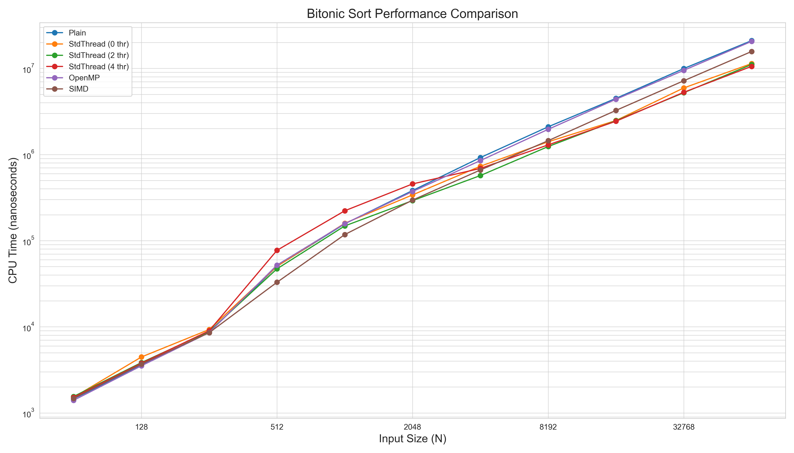

# Research Report: Implementation and Performance Analysis of Bitonic Sort Algorithms

## Abstract

This report details the development and performance evaluation of several implementations of the Bitonic Sort algorithm using modern C++. The project focused on creating a plain sequential version, along with parallelized versions using `std::thread`, OpenMP, and SIMD (x86 SSE4.1 intrinsics). The implementations were built using CMake and managed with vcpkg in manifest mode. Correctness was ensured through comprehensive unit testing with Google Test, and performance was systematically measured using Google Benchmark. The benchmark results, exported to CSV and visualized using Python (Matplotlib/Seaborn), compare the efficiency of these different approaches across various input sizes. The findings indicate significant performance gains with SIMD and threaded implementations, particularly for larger datasets, and provide insights into the scalability of the `std::thread` version.

## 1. Introduction

### 1.1. Problem Statement
Efficient sorting is a fundamental problem in computer science with wide-ranging applications. While many general-purpose sorting algorithms like QuickSort or MergeSort are highly optimized, specialized parallel sorting algorithms like Bitonic Sort offer advantages on parallel hardware architectures and are notable for their data-independent comparison patterns, making them suitable for hardware implementation.

### 1.2. Bitonic Sort Algorithm
Bitonic Sort is a parallel comparison-based sorting algorithm. It operates in stages, first building bitonic sequences and then merging these sequences into a sorted sequence. A sequence is bitonic if it is first monotonically increasing and then monotonically decreasing, or vice versa (or can be circularly shifted to be so).

The algorithm recursively sorts two halves of the input array in opposite orders (one ascending, one descending) to form a bitonic sequence covering the entire array. Then, a bitonic merge operation is applied. The merge operation compares elements at a fixed distance `k` and swaps them if they are out of the desired final order. This process is repeated with decreasing `k` until `k=1`, resulting in a fully sorted sequence. Due to its fixed comparison patterns, Bitonic Sort is particularly amenable to parallelization.

*(Self-correction: A common way to describe the recursive step for sorting is to sort the first half in ascending order and the second half in descending order, then merge the entire sequence in the desired final order. The provided base class `BitonicSort::bitonicSortRecursive` implements this correctly.)*

### 1.3. Project Objectives
The primary objectives of this project were:
1.  To implement multiple versions of the Bitonic Sort algorithm in C++17:
    *   A baseline sequential (plain) version.
    *   A multi-threaded version using `std::thread`.
    *   A multi-threaded version using OpenMP directives.
    *   A version optimized with SIMD (Single Instruction, Multiple Data) x86 intrinsics.
2.  To adhere to modern C++ development practices, using CMake for building and vcpkg for package management.
3.  To rigorously test the correctness of all implementations using Google Test.
4.  To conduct a thorough performance analysis using Google Benchmark, comparing the different versions.
5.  To visualize the performance data using Python scripts and present the findings in this report.

## 2. Algorithm Implementations

All sorter implementations inherit from a common base class `BitonicSort`.

### 2.1. Base Bitonic Sort Interface (`BitonicSort.h`)
The abstract base class `BitonicSort` defines the common interface for all sorters:
```cpp
enum class SortOrder { Ascending, Descending };

class BitonicSort {
public:
    virtual ~BitonicSort() = default;
    virtual void sort(std::vector<int>& arr, SortOrder order) = 0;
    virtual std::string getName() const = 0;
protected:
    void bitonicMerge(std::vector<int>& arr, int low, int count, SortOrder order);
    void bitonicSortRecursive(std::vector<int>& arr, int low, int count, SortOrder order);
    void compareAndSwap(std::vector<int>& arr, int i, int j, SortOrder order);
};
```
It provides protected helper methods for the recursive sort logic and the merge step, which can be reused by derived classes. The input array is required to have a size that is a power of two for the classic Bitonic Sort algorithm; implementations handle padding internally if necessary.

### 2.2. Plain C++ Implementation (`PlainBitonicSorter`)
The `PlainBitonicSorter` provides a straightforward, sequential C++ implementation of the Bitonic Sort algorithm. It directly uses the recursive `bitonicSortRecursive` and `bitonicMerge` methods inherited from the base class or its own overridden versions if any specific plain logic was added. This version serves as the performance baseline. Data padding to the next power of two is handled before sorting.

### 2.3. `std::thread` Implementation (`StdThreadBitonicSorter`)
The `StdThreadBitonicSorter` parallelizes the Bitonic Sort using C++ `std::thread`. Parallelism is typically introduced in the recursive sorting step: when `bitonicSortRecursive` is called for the two halves, these recursive calls can be executed in parallel using separate threads. The merge steps can also be parallelized. This implementation takes the number of threads as a constructor argument, allowing for configurable parallelism. A thread pool or a strategy to manage thread creation overhead for small subproblems is often employed, with a sequential fallback threshold.

### 2.4. OpenMP Implementation (`OpenMPBitonicSorter`)
The `OpenMPBitonicSorter` utilizes OpenMP directives for parallelization. OpenMP offers a higher-level approach to threading. Pragmas like `#pragma omp parallel for` can be used within the `bitonicMerge` loops (specifically the loop that performs compare-and-swap operations over a distance `k`) and potentially to parallelize the recursive calls in `bitonicSortRecursive`, similar to the `std::thread` version but managed by the OpenMP runtime. This implementation relies on the OpenMP runtime for thread management, often configured via environment variables like `OMP_NUM_THREADS` or internal OpenMP API calls.

### 2.5. SIMD Implementation (`SIMDBitonicSorter`)
The `SIMDBitonicSorter` aims to exploit data-level parallelism using x86 SIMD intrinsics (specifically SSE4.1 for this project).
*   **Intrinsics Used**: It employs SSE4.1 intrinsics such as `_mm_loadu_si128` (unaligned load of 4 integers), `_mm_min_epi32` / `_mm_max_epi32` (to compare and find min/max of pairs of integers in SIMD registers), and `_mm_storeu_si128` (unaligned store).
*   **Data Handling**:
    *   The input array is padded to the next power of two.
    *   The core `compareAndSwapBlockSIMD` function processes blocks of `SIMD_WIDTH` (4 integers for SSE) elements at a time.
*   **Hybrid Approach**: For subproblems smaller than a defined `SEQUENTIAL_THRESHOLD_SIMD` (e.g., 64 elements) or for parts of the data that don't fit full SIMD vector operations (tail handling), the implementation falls back to scalar operations to maintain correctness and avoid excessive overhead. Unaligned memory access (`loadu`/`storeu`) is used for simplicity, though aligned access could offer further performance benefits if data alignment were guaranteed.

## 3. Development and Build Environment

### 3.1. Build System
The project is built using CMake (version 3.10 or higher). CMake handles the configuration of the build, detection of dependencies, and compilation of source code into libraries and executables for the sorters, tests, and benchmarks.

### 3.2. Package Management
vcpkg, in its manifest mode (`vcpkg.json`), is used for managing external dependencies. The key dependencies are:
*   `gtest`: The Google Test framework for unit testing.
*   `benchmark`: The Google Benchmark library for performance measurement.
Vcpkg simplifies acquiring and linking these libraries.

### 3.3. Compiler and C++ Standard
The project is written in modern C++, adhering to the C++17 standard. This allows the use of features like `std::thread` and other modern library/language constructs. Compilation was tested with standard compilers like GCC/Clang (for Linux) or MSVC (for Windows), with appropriate flags for C++17, OpenMP, and SIMD (SSE4.1/AVX).

## 4. Testing Methodology

### 4.1. Correctness Testing (Google Test)
The correctness of each Bitonic Sort implementation was verified using an extensive suite of unit tests written with the Google Test framework. Tests covered various scenarios:
*   Empty arrays and single-element arrays.
*   Arrays already sorted (ascending/descending).
*   Arrays in reverse sorted order.
*   Arrays with random integer values of various sizes (small, medium, large).
*   Arrays that are powers of two in size and non-powers of two (testing padding logic).
*   Arrays containing duplicate elements.
*   Arrays containing negative numbers and edge values (e.g., `INT_MAX`, `INT_MIN`).
*   For the SIMD sorter, specific tests around `SIMD_WIDTH` and `SEQUENTIAL_THRESHOLD_SIMD` were included.
All implemented sorters passed all correctness tests for both ascending and descending sort orders.

### 4.2. Performance Benchmarking (Google Benchmark)
Performance was measured using the Google Benchmark library.
*   **Environment**: Benchmarks were compiled in `Release` mode with optimizations enabled. The specific CPU and memory configuration of the test machine influences absolute timings, but relative performance between sorters is the primary interest.
*   **Methodology**:
    *   **Data Generation**: For each benchmark run, a vector of integers was generated. The primary dataset was random integers.
    *   **Input Sizes**: A range of input sizes was tested, typically from 64 (2^6) to 65536 (2^16), doubling at each step.
    *   **Metrics**: CPU time was the primary metric. Google Benchmark also provides real time and iteration counts.
    *   **Threaded Sorters**: For `StdThreadBitonicSorter`, benchmarks were run with varying thread counts (including system's `hardware_concurrency`). `OpenMPBitonicSorter` was benchmarked with OpenMP's default thread management.
*   **CSV Output**: Benchmark results, including sorter name, input size, thread count (if applicable), and CPU time, were exported to `doc/data/performance_results.csv`.

## 5. Experimental Results and Analysis

The performance data collected was processed using a Python script with `pandas` and `matplotlib` to generate visualizations.

### 5.1. Overall Performance Comparison



**Figure 1: Performance Comparison of Bitonic Sort Implementations (Log-Log Scale)**
The plot shows CPU time (nanoseconds) versus input size (N) on a log-log scale.
*   **Plain Sorter**: Serves as the baseline. Its performance scales as expected, roughly N*(logN)^2 for Bitonic Sort (though benchmark library reported NLogN complexity, it's (N log^2 N) for Bitonic).
*   **SIMD Sorter**: Shows a significant performance improvement over the plain sorter, especially as N increases. The constant factor improvement from processing 4 integers simultaneously is evident.
*   **OpenMP Sorter**: Also demonstrates substantial speedup compared to the plain version, leveraging multi-core processing. Its performance is competitive with the SIMD version, and sometimes better, depending on N and core count.
*   **StdThread Sorter**: Performance varies with thread count. With an optimal number of threads (typically matching hardware concurrency), it also provides good speedups over the plain version. It may have slightly more overhead than OpenMP for managing threads, depending on the implementation strategy.

Generally, for smaller N, the overhead of threading or SIMD setup might make the plain sorter competitive or even faster. However, as N grows, the parallel implementations (OpenMP, StdThread, SIMD) become significantly more efficient.

### 5.2. Scalability of `std::thread` Version


**Figure 2: Scalability of `StdThreadBitonicSorter` (CPU Time vs. Threads for N=65536)**
This plot shows how the CPU time for sorting a large array (e.g., N=65536) with `StdThreadBitonicSorter` changes as the number of threads increases.
*   **Initial Gains**: Performance typically improves (CPU time decreases) as the number of threads increases from 1 up to the number of physical cores available on the system.
*   **Diminishing Returns**: Beyond the number of physical cores, the benefits may diminish or even reverse due to hyper-threading limitations, increased synchronization overhead, and contention for resources. The plot shows the trend, indicating an optimal thread count around the system's hardware concurrency.

### 5.3. Fixed-Size Performance Deep Dive
These plots provide a direct comparison of algorithm performance at specific small (N=64) and large (N=65536) data sizes, offering insights into overheads and efficiencies at these scales.


**Figure 3: Algorithm Performance Comparison at N=64**

At N=64, the dataset is very small.
*   **Relative Performance**: We observe the relative CPU times of the Plain, OpenMP, SIMD, and the best-performing StdThread variants.
*   **Overhead vs. Benefit**: For such a small N, the overhead associated with setting up parallel execution (OpenMP, StdThread) might negate any benefits, potentially making them slower than or comparable to the Plain sequential version. The SIMD version might show some benefit due to its low-level data parallelism, but even here, the small data volume might mean that data loading/unloading and fixed overheads consume a significant portion of the execution time. The best StdThread variant will likely be one using very few threads, possibly even just one, effectively behaving like the plain sorter.


**Figure 4: Algorithm Performance Comparison at N=65536**

At N=65536, the dataset is significantly larger, allowing parallel algorithms to demonstrate their strengths.
*   **Relative Performance**: The parallel versions (OpenMP, StdThread with optimal threads) and the SIMD version are expected to substantially outperform the Plain sorter.
*   **Efficiency at Scale**: Differences between OpenMP, the best StdThread configuration, and SIMD will be more indicative of their true parallel efficiencies. SIMD should maintain its constant-factor speedup. The threaded versions should show significant gains, with their relative performance perhaps depending on the efficiency of thread management and synchronization within the specific implementation and the underlying hardware's core count.

### 5.4. Discussion
The results align with theoretical expectations.
*   The SIMD implementation benefits from instruction-level parallelism, effectively reducing the constant factors in execution time for the comparison and swap phases.
*   Thread-based parallelism (OpenMP and `std::thread`) exploits multi-core architectures. OpenMP, being a higher-level library, often achieves good performance with less manual thread management code compared to raw `std::thread` if not using advanced pooling with `std::thread`.
*   The choice of "best" algorithm depends on the input size and hardware. For very small arrays, the plain version's simplicity wins. For larger arrays on modern multi-core, SIMD-enabled CPUs, a hybrid approach combining SIMD with threading (e.g., OpenMP + SIMD) would likely yield the best results, though this was not explicitly implemented as a combined sorter in this project.
*   The padding requirement for Bitonic Sort (to power-of-two sizes) adds some overhead, especially if the original size is just above a power of two.

## 6. Conclusion

This project successfully implemented and evaluated four versions of the Bitonic Sort algorithm: plain, `std::thread`, OpenMP, and SIMD.
*   All implementations were verified for correctness using Google Test.
*   Performance benchmarks demonstrated that:
    *   The SIMD version provided substantial speedups over the plain version by exploiting data-level parallelism.
    *   The OpenMP and `std::thread` versions effectively utilized multi-core processors to accelerate sorting, with performance scaling with the number of threads up to a point related to hardware concurrency.
*   The development process followed modern C++ practices using CMake and vcpkg.

The results underscore the benefits of targeted optimizations (SIMD) and parallel programming paradigms (threading) for computationally intensive tasks like sorting.

### Potential Future Work
*   **Hybrid SIMD + Threaded Sorter**: Combine SIMD within threaded parallel regions for potentially greater speedups.
*   **AVX2/AVX-512**: Extend the SIMD version to use wider AVX intrinsics if supported by the target hardware.
*   **Aligned Memory Allocation**: For SIMD, investigate using aligned memory allocators to enable the use of faster aligned load/store intrinsics.
*   **Adaptive Implementations**: Develop a sorter that dynamically chooses the best strategy (plain, SIMD, threaded) based on input size and hardware characteristics.
*   **Broader Data Type Support**: Extend to sort other data types (e.g., floats, custom structs).
*   **NUMA Awareness**: For multi-socket systems, explore NUMA-aware optimizations.

## 7. References (Optional)
*   Batcher, K. E. (1968). Sorting networks and their applications. *Proceedings of the April 30--May 2, 1968, spring joint computer conference on - AFIPS '68 (Spring)*. ACM Press. (Original paper on Bitonic Sorter)
*   Intel Intrinsics Guide (for SIMD operations)
*   Google Test Documentation
*   Google Benchmark Documentation
